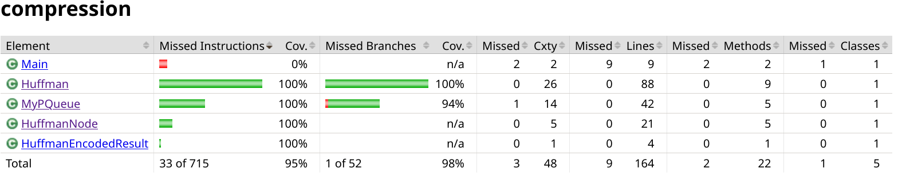

## Report for week 7

last week i figured out the issues i was having with the core functionality of the program. today i spent fleshing out a couple of minor bugs i had and wrote a few tests to cover the Huffman class. from the last week report up until this point i've spent around 7 hours

